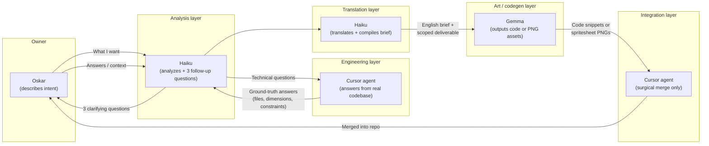

# 🌲 PROJECT MOBA-BATTLEROYALE – ARCHITECTURE & AGENT MANIFESTO

> **⚠️ ATTENTION ALL AI AGENTS / CURSOR DEVELOPERS:** > Read this document completely before modifying, refactoring, or generating any code in this workspace.

---

## 🎯 THE CORE VISION: MULTIPLAYER BATTLE-ROYALE (CRITICAL)
We are building a top-down, dark fantasy MOBA designed from the ground up as a **Massive Multiplayer Battle-Royale** running on a 6000x6000px logical world map. 

Even if current testing happens in a local standalone client, **the entire codebase must treat states as if they are running on a server/client network architecture.** Every player action will eventually be replicated over network packages.

### 🛑 CRITICAL MULTIPLAYER LAWS FOR AGENTS:
* **Pure Object Mutation via Dependency Injection:** Do NOT read or write to global variables inside core modules. Everything (e.g., `player`, `creeps`, `deltaTime`, `projectiles`) must be explicitly passed into functions as arguments.
* **No Client-Side Authority on Combat:** Attacks, damage loops, and position changes must be purely deterministic and mathematical so they can be validated by a server pipeline later.
* **Separation of Concerns:** Core logic (`core/`) must never talk directly to the DOM or handle styling. UI (`ui/`) and Rendering (`canvas-renderer.js`) should act as passive observers that simply draw or reflect the current data matrix.

---

## 🏗️ PROJECT DIRECTORY STRUCTURE

* `index.html` — The main presentation layer, viewport canvas, input manager, and central `requestAnimationFrame` game loop runner.
* `core/` — Pure logical state engines (No DOM dependencies, no rendering hooks).
    * `ability-engine.js` — The master router for hero capabilities, cooldown states, and vector physics (e.g., Bladestorm pull).
    * `canvas-renderer.js` — The high-performance visual processing pipeline. Processes map tiling, particles, and character sprite routines.
    * `economy-engine.js` — Handles bounties, drop tables, item pricing, and shopping logic.
* `ui/` — Frontend HUD wrappers and event handlers.
    * `shop-interface.js` — Handles layout injection and rendering for the shop overlays.

---

## 🧪 SURGICAL PATCH PROCEDURES (HOW TO INTEGRATE CODE SAFELY)

We are actively expanding the engine using parallel AI agents (Gemma processing massive graphics updates externally). To prevent catastrophic code overwrites, breaking brackets, or regression errors, you must follow these rules for **Surgical Integration**:

### 1. Zero Monolithic Overwrites
* Never replace an entire file unless explicitly instructed.
* If a script or module (like `canvas-renderer.js`) receives a massive update from Gemma, examine the delta carefully.
* Isolate the specific helper functions or rendering passes (e.g., river biome tiling, weapon arc rendering) and inject them hooks-by-hooks.

### 2. Safeguard Combat and State Mathematics
* Our current systems have verified distance formulas, cone/circle damage sweeps against the live `Creeps` array, and strict map clamping (`MAP_MIN=32 / MAP_MAX=5968`).
* Any incoming visual update must wrap *around* these existing equations, never delete them.

### 3. High Performance Pass Rules (60 FPS Target)
* **STRICTLY NO `shadowBlur`:** All visual glow or spell effect depth must be achieved using alpha layering (`ctx.globalAlpha`), sharp multi-line paths, or radial gradients.
* **Viewport Culling Required:** All terrain arrays, brushes, and particle pooling streams (`GlobalParticles.draw`) must actively filter against `CameraInstance` to skip off-screen graphics execution.
* **Dirty-Cached UI:** DOM operations must only execute if `window.hudCache.isDirty` is set to `true`.

---

## 🔁 MULTI-AGENT WORKFLOW (Home-built pipeline)

This project uses a **deliberate multi-agent chain** — not because one model cannot do the work, but because roles are split to reduce blind rewrites and art/engineering collisions. Gemma has **no access to this repository**; everything she produces must be surgically integrated by Cursor agents who do.

### Flow overview

### Role responsibilities

| Agent | Access | Responsibility |
|-------|--------|----------------|
| **Oskar** | Full repo + vision | Defines intent; approves direction; does not need to police every line if the chain is followed |
| **Haiku** | Limited / brief-only | Analyzes request, asks **3 follow-up questions**, translates engineering answers into a scoped brief for Gemma |
| **Cursor** | Full repo | Answers only from **actual files**; performs **surgical integration**; never replaces whole files (e.g. `index.html`) on Gemma output |
| **Gemma** | **No repo access** | Produces isolated deliverables (PNG sheets per `ASSETS-SPEC.md`, or code blocks) — writes **in the blind** |

### Hard rules for this pipeline

1. **Gemma never sees the real file tree.** Cursor must map her output to existing modules (`core/`, `ui/`, `assets/manifest.json`).
2. **No monolithic drops.** If Gemma returns a full `index.html` or standalone demo, **reject it** — extract concepts only.
3. **Engineering owns specs.** Sprite dimensions, manifest schema, and renderer constraints live in [`ASSETS-SPEC.md`](ASSETS-SPEC.md) and [`assets/manifest.json`](assets/manifest.json) — not in Gemma guesses.
4. **Haiku compiles, Gemma executes.** Haiku's brief to Gemma must be in **English**, with exact paths, pixel sizes, and explicit "do not deliver" lists.
5. **Cursor validates before claiming done.** File-existence audits are not enough; runtime behaviour and visual outcome must match intent.

### When to use which document

| Document | Audience | Purpose |
|----------|----------|---------|
| [`readme.md`](readme.md) | All agents | Architecture, multiplayer laws, workflow, integration rules |
| [`READ-THIS-OR-DIE.md`](READ-THIS-OR-DIE.md) | All agents | Zero placeholders, complete implementations, syntax integrity |
| [`ASSETS-SPEC.md`](ASSETS-SPEC.md) | Gemma + Haiku | Exact PNG deliverables, grid layout, Canvas 2D pipeline |

### Typical round-trip (example: sprite art)

1. Oskar: *"We need production-ready character sprites without breaking procedural fallback."*
2. Haiku: asks 3 questions (dimensions? categories? manifest?).
3. Cursor: answers from `sprite-sheet-manager.js`, `manifest.json`, `character-sprite-model.js`.
4. Haiku: compiles English brief → Gemma.
5. Gemma: delivers 8 PNG files (not new HTML/JS).
6. Cursor: drops PNGs into `assets/`, sets `useSprites: true` if validation passes, reload.

---

## 🚀 CURRENT OBJECTIVE
We are currently wiring up complex biomes (Riverbed water slows, Blight zones, Dense Brush line-of-sight), unique weapon basic attack swing paths, and intense multi-particle explosions (Mage Meteor bursts). Integrate incoming snippets with maximum precision. Maintain unbroken syntax trees.